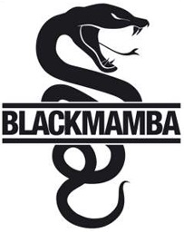

    
    

# 💥 WEBBOT  BLACK MAMBA💥

## **Equipe**  💻

#### Dev Team
[Arthur Cardoso](https://gitlab.com/arthur_rinaldi00)  
[Daniel Delgado](https://gitlab.com/DNLMR)  
[Julio Cézar](https://gitlab.com/j.cezar4152)  
[Sabrina Calado](https://gitlab.com/sabrinacalado)

#### Masters
[Lucas Leão](https://gitlab.com/lucasdlg5)  
[Kevin Hizatsuki](https://gitlab.com/kevin799)

## **O que é o Black Mamba!** 🔍

O Bot Black Mamba tem como diretriz apontar um bom momento para comprar ou vender uma ação.
Para isso o bot irá capturar os dados em tempo real do valor de uma ação e comparar com os historicos de variações dessa mesma ação em outros peridos em conjunto com uma mapeamento das noticias que podem influenciar o valor da ação.

## **But..Why ?** ☝️ 

Queremos auxiliar pessoas com vontade de iniciar sua vida como Traders casuais porem não possuem o tempo necessario para aprender sobre investimentos, o nosso Bot auxilia os usuários a entrarem nesse universo com mais segurança e com certo amparo.

## **Arsenal** 🔫

Contamos com as seguintes ferramentas para desenvolver o projeto:

* Python 3.7 - Linguagem principal;
* Zen of Python - boas práticas para o Projeto;
* PyCharm e/ou Visual Studio Code - IDE's;
* Django, Javascript, HTML5, CSS,  Bootstrap - Front End WEB;
* MySQL - Banco de Dados;
* Conceitos do SCRUM - Norteador do Projeto.
* Bibliotecas Python - (...)

## **Oque o usuário pode fazer ?** 🔑

* Criação de conta (normal ou usuário “Gold");
* Consultar gráfico em tempo real e histórico;
* Alterar informações de seu cadastro;
* Alterar parametros de notificações.

## **How does it Work ?** 👷

(...) Como funciona o back

